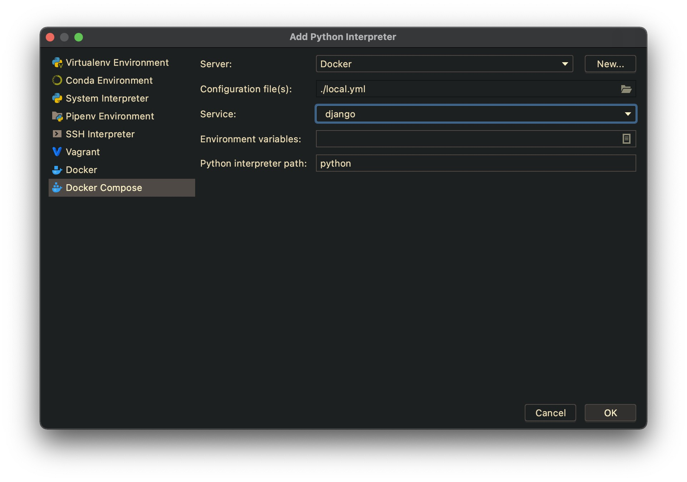
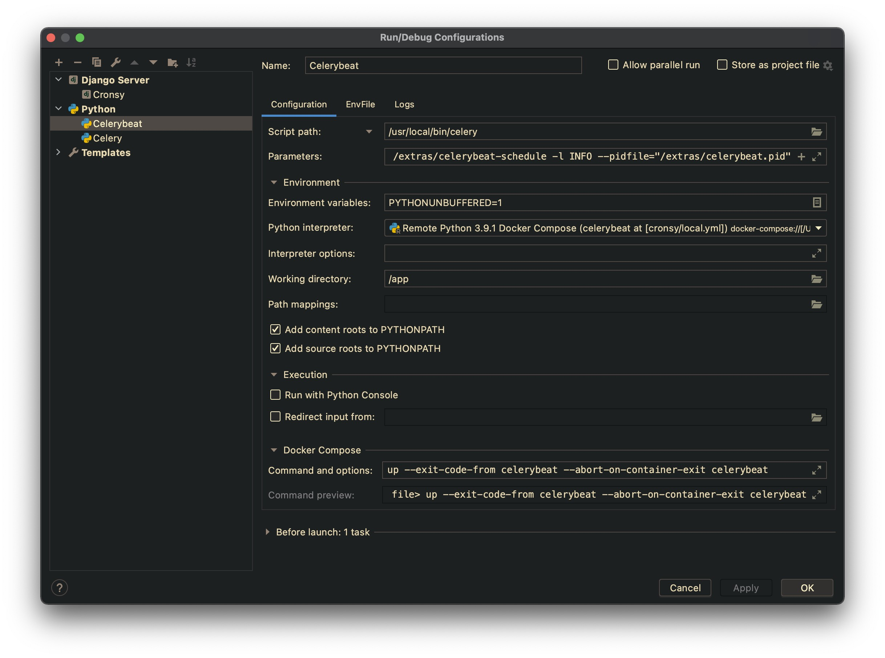

# Django Docker Boilerplate by PLANEKS

📌 Insert here the project description. Also, change the caption of
the README.md file with name of the project.

## How to create the project

📌 Delete this section after creating new project.

Download the last version of the boiler plate from the repository: https://github.com/planeks/django-docker-boilerplate

You can download the ZIP archive and unpack it to the directory, or clone the repository (but do not forget to clean the Git history in that case). 

Use the global find and replace for changing the string `NEWPROJECTNAME` in the files in the `src` directory to the proper project name. The easiest way to do it just use `Replace` feature in the IDE.

There are three files where the changes should be done:

```
src/config/settings/base.py
src/config/templates/index.html
src/config/urls.py
```

## 🐳 Install Docker and Docker Compose

For the local computer we recommend using Docker Desktop. 
You can download it from the official site: https://www.docker.com/products/docker-desktop

There are versions for Windows, Linux and Mac OS.

For the server installation you need the Docker Engine and Docker Compose. 
Use the following commands to install Docker on Ubuntu Linux:

```shell
# Add Docker's official GPG key:
$ sudo apt-get update
$ sudo apt-get install ca-certificates curl
$ sudo install -m 0755 -d /etc/apt/keyrings
$ sudo curl -fsSL https://download.docker.com/linux/ubuntu/gpg -o /etc/apt/keyrings/docker.asc
$ sudo chmod a+r /etc/apt/keyrings/docker.asc

# Add the repository to Apt sources:
$ echo \
  "deb [arch=$(dpkg --print-architecture) signed-by=/etc/apt/keyrings/docker.asc] https://download.docker.com/linux/ubuntu \
  $(. /etc/os-release && echo "$VERSION_CODENAME") stable" | \
  sudo tee /etc/apt/sources.list.d/docker.list > /dev/null
$ sudo apt-get update
$ sudo apt-get install docker-ce docker-ce-cli containerd.io docker-buildx-plugin docker-compose-plugin
```

> If you are using another Linux distribution, please, check the official documentation: https://docs.docker.com/engine/install/

Test if Docker is installed correctly:

```shell
$ sudo systemctl status docker
```

Add the current user to the `docker` group (to avoid using `sudo`):

```shell
$ sudo usermod -aG docker ${USER}
```

## 🔨Setup the project locally

You need to run the project locally during the development. First of all, copy the `dev.env` file to the `.env` file in the same directory.

```shell
$ cp dev.env .env
```

Open the `.env` file in your editor and specify the settings:

```shell
PYTHONENCODING=utf8
DEBUG=1
CONFIGURATION=dev
DJANGO_LOG_LEVEL=INFO
SECRET_KEY="<secret_key>"
POSTGRES_HOST=postgres
POSTGRES_PORT=5432
POSTGRES_DB=db
POSTGRES_USER=dbuser
POSTGRES_PASSWORD=dbpassword
REDIS_URL=redis://redis:6379/0
SITE_URL=http://myproject.local:8000
EMAIL_HOST=mailhog
EMAIL_PORT=1025
```

📌 Generate the secret key for the project and paste it to the `.env` file.
Also, generate the reasonably good password for the database user.

We strongly recommend creating some local domain in your `/etc/hosts` file to work with the project :

```
127.0.0.1   myproject.local
```

We specify the following volume in the application container:

- `/data` -> `data/dev`

> If you use Linux and Docker Engine for the local development you need to
> setup proper permissions for the volume. It is important if you want to
> use Docker without `sudo`. Check the `init_production_volumes.sh` script
> and the "Deploying the project to the server" section for more details,
> and adapt it for your needs.

You need to edit `Dockerfile`, `entrypoint` and `compose.dev.yml` files if you need to add other directories to the container and define them as volumes.

Use the following command to build the containers:

```shell
$ docker compose -f compose.dev.yml build
```

Use the next command to run the project in detached mode:

```shell
$ docker compose -f compose.dev.yml up -d
```

Use the following command to run `bash` inside the container if you want to run a management command like Django interactive shell.

```shell
$ docker compose -f compose.dev.yml exec django bash
```

Or, you can run the temporary container:

```shell
$ docker compose -f compose.dev.yml run --rm django bash
```

## 🏃‍ Running the project in PyCharm

> The Docker integration features are available only in the Professional version
of PyCharm.

Go to `Preferences` -> `Project` -> `Python Interpreter`. Click the gear icon
and select the `Add...` item.

Select `Docker Compose` and specify your configuration file (`compose.dev.yml`) and
the particular service.



> If the corresponding windows are differ on your version of PyCharm, and
> you have troubles with configuring the remote interpreter, you can configure
> classic UI in the registry. Go to `Help` -> `Find Action...` and type `Registry`.
> Find the `python.use.targets.api` option and disable it. Restart PyCharm.

You can also change the interpreter name for better readability later.


You need to specify remote interpreters for each of the containers you are working
with Python. For example, if you have three containers, like `django`, `celeryworker`
and `celerybeat`, you need to setup three remote interpreters.

Now you can go to `Run/Edit Configurations...` and add the particular running configurations.

You can use the standard `Django Server` configuration to run `runserver`
Specify the proper Python Interpreter and set `Host` option to `0.0.0.0`.
It is necessary, because the application server is running inside the container.


You can use `Python` configuration template to run Celery. Do not forget to
set the proper remote interpreter and working directory. Also, set the following options:

- `Script path` : `/usr/local/bin/watchgod`
- `Parameters` : `celery.__main__.main --args -A config worker --loglevel=info -P solo`

Here we use `watchgod` utility to automatically restart Celery if
the source code has been changed.


Also, create the similar configuration for Celery Beat. Use the following options:

- `Script path` : `/usr/local/bin/celery`
- `Parameters` : `-A config beat -l INFO`

Make sure you specify the proper path for `celerybeat.pid` with proper
access rights.



> Configuring runners for the PyCharm is optional but simplify using
> debugger. Anyway you can just use `docker compose -f compose.dev.yml up -d`
> in the terminal.

## Deploying the project to the server

- [Automated provisioning with Ansible](docs/deployment_automated.md)
- [Manual server setup](docs/deployment_manual.md)
- [GitHub Actions setup](docs/github-actions-setup.md)
- [SSH key setup](docs/ssh-key-setup.md)
- [Backup and restore](docs/backup.md)

📌 If this document does not contain some important information, please, add it.
